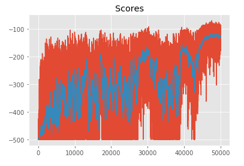

# Reinforcement-learning-exercises-with-[OpenAI-Gym](https://gym.openai.com/docs/#spaces)

A recap on RL used for this exercises with the [cheatsheet](cheatsheet.pdf). 

More theory about Reinforcement Learning can be find [here](https://mitpress.mit.edu/books/reinforcement-learning-second-edition).

 `Monte_carlo.pdf` : Summary of the Monte Carlo method.
 
 `Temporal difference methods summary.pdf` : Summary of the temporal difference methods.

## OpenAI Gym Black Jack with Monte Carlo methods

Using the Monte carlo methods, we will solve the [Black Jack environment](https://github.com/openai/gym/blob/master/gym/envs/toy_text/blackjack.py).

`Monte_Carlo.ipynb` : the Jupyter notebook where Monte Carlo methods are used to solve the environment.

`plot_util.py` : contains a plotting function for visualizing state-value functions and policies.

Optimal policy we are looking for:

The result we have:

## Temporal difference methods on OpenAI cliffwalking environment 

Implementation of Sarsa, Q-Learning and Expected Sarsa in order to solve the [CliffWalking environment](https://github.com/openai/gym/blob/master/gym/envs/toy_text/cliffwalking.py).

`Temporal_Difference_Methods.ipynb` : Implementation of the three methods.

`plot_utils.py` : contains a plotting function for visualizing state-value functions and policies.

`check_test.py` : contains unit tests to check the validity of your implementations.

The goal is to obtain state-value functions for Sarsa, Q-learning and Expected Sarsa:

Average reward:

## OpenAI Gym Taxi-v2 with Temporal difference methods

Work based on the part 3.1 of this [paper](https://arxiv.org/pdf/cs/9905014.pdf) to solve the [Taxi-v2 environment](https://github.com/openai/gym/blob/master/gym/envs/toy_text/taxi.py).

`agent.py`: The reinforcement learning agent is developed here.

`monitor.py`: The interact function tests how well your agent learns from interaction with the environment.

`main.py`: Run this file in the terminal to check the performance of your agent.

When you run `main.py`, the agent that specify in `agent.py` interacts with the environment for 20,000 episodes. The details of the interaction are specified in `monitor.py`, which returns two variables: avg_rewards and best_avg_reward. The best_avg_reward is used to see how well the agent performed in the task.

## Reinforcement learning in continuous spaces

### Discretization

Discretizing a continuous environement, ([MountainCar-v0](https://gym.openai.com/envs/MountainCar-v0/)) , in order to apply reinforcement learning algorithms.

`Discretization.ipynb` : Implementation of the technique.

Discretization process:

Score evolution while training:

Q-Table result:

### Tile Coding

Tile coding is an innovative way of discretizing a continuous space that enables better generalization compared to a single grid-based approach. The fundamental idea is to create several overlapping grids or tilings; then for any given sample value, you need only check which tiles it lies in. You can then encode the original continuous value by a vector of integer indices or bits that identifies each activated tile.

Tile coding on the [Acrobot-v1](https://gym.openai.com/envs/Acrobot-v1/) environement in order to apply rienforcement learning.

`Tile_Coding_Solution.ipynb` : Implementation of the technique.

Tile coding process:

Score evolution while training:

